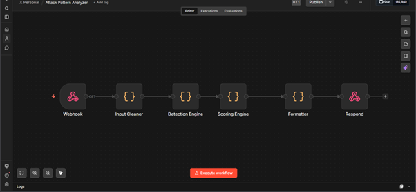
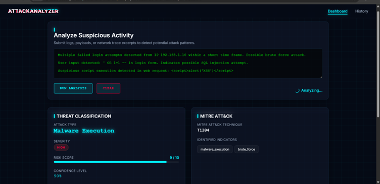
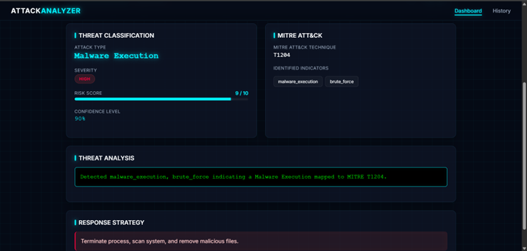
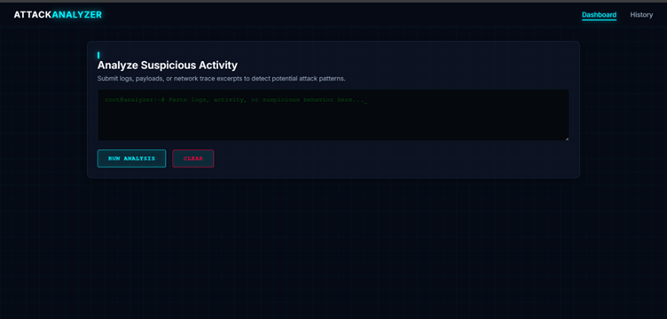

# Attack Analyzer

Attack Analyzer is an AI-assisted cybersecurity analysis platform designed to identify suspicious activity, classify potential threats, assess risk levels, map findings to industry-standard attack frameworks, and provide actionable security recommendations.

---

## Overview

Security teams often receive large volumes of alerts and suspicious activity reports that require investigation and prioritization. Attack Analyzer streamlines this process by automatically evaluating security events, identifying indicators of compromise, classifying threats, and generating structured security assessments.

The platform helps analysts quickly understand potential risks and supports faster incident response and decision-making.

---

## Key Features

- Automated threat analysis
- Security event classification
- Risk assessment and scoring
- Threat severity evaluation
- MITRE ATT&CK technique mapping
- Security recommendation generation
- Structured threat reporting
- Dashboard-based visualization

---

## Workflow Design

The analysis workflow follows a structured security assessment pipeline:

1. Receive security event or activity description
2. Process and normalize input
3. Detect suspicious indicators
4. Classify potential threat category
5. Calculate risk and severity levels
6. Map findings to MITRE ATT&CK techniques
7. Generate recommendations
8. Produce structured security report

### Workflow Architecture

---

## Threat Detection

The system analyzes incoming activity descriptions and identifies indicators that may represent malicious or suspicious behavior.

Detection categories may include:

- Malware Activity
- Phishing Attempts
- Brute Force Activity
- Reconnaissance Behavior
- Unauthorized Access Attempts
- System Anomalies

### Threat Detection Output

---

## MITRE ATT&CK Mapping

To provide additional context and standardization, identified threats are mapped to relevant MITRE ATT&CK techniques.

This enables:

- Better threat understanding
- Improved analyst workflows
- Standardized reporting
- Security framework alignment

### MITRE Mapping Output

---

## Security Dashboard

The dashboard presents threat intelligence and analysis results in a structured and easy-to-understand format.

Displayed information may include:

- Threat Category
- Severity Level
- Risk Score
- Confidence Assessment
- Security Recommendations
- MITRE Technique References

### Dashboard View

---

## Benefits

### Faster Threat Assessment

Reduces the time required to analyze and classify suspicious activities.

### Improved Security Visibility

Provides clear insight into potential threats and associated risks.

### Standardized Analysis

Uses structured evaluation methods for consistent threat assessment.

### Better Incident Response

Supports quicker decision-making through prioritized risk information.

### Enhanced Threat Context

Maps findings to recognized cybersecurity frameworks for easier interpretation.

---

## Technology Stack

- n8n Workflow Automation
- JavaScript
- AI-Assisted Analysis
- MITRE ATT&CK Framework
- REST APIs
- Security Automation Workflows

---

## Use Cases

- Security Operations Centers (SOC)
- Incident Response Teams
- Threat Hunting Activities
- Security Awareness Training
- Log and Event Analysis
- Cybersecurity Demonstrations
- Security Workflow Automation

---

## Project Highlights

- Designed an end-to-end cybersecurity analysis workflow
- Automated threat classification and assessment
- Implemented risk evaluation processes
- Integrated MITRE ATT&CK mapping concepts
- Generated structured security recommendations
- Built an analyst-friendly threat review dashboard

---

## Future Enhancements

- Real-time threat intelligence integration
- Advanced behavioral analysis
- IOC enrichment capabilities
- Log ingestion pipelines
- SIEM integration
- Historical threat trend analysis
- Multi-source event correlation

---

## Author

Developed as a cybersecurity automation project focused on threat analysis, risk assessment, attack classification, and security workflow optimization.
